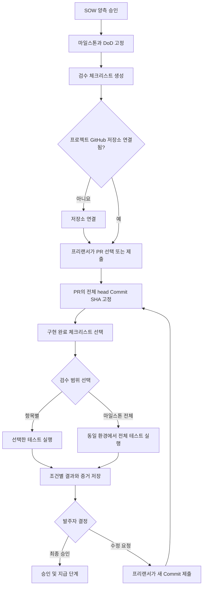

# GitHub 기반 마일스톤 실행 검수 설계

> 상태: 구현 기준 초안
> 작성일: 2026-08-12
> 적용 범위: LinKross 2주 발표용 MVP와 이후 정식 기능의 공통 제품 흐름

## 1. 문서 목적

이 문서는 승인된 SOW의 마일스톤과 Definition of Done(DoD)을 실제 코드 제출 및 실행 검수로 연결하는 방식을 정의한다.

LinKross의 마일스톤 검수는 단순히 GitHub에 코드가 존재하는지 확인하는 기능이 아니다. 특정 Commit SHA의 전체 프로젝트를 별도 환경에서 설치, 빌드, 실행하고, 사전에 합의한 체크리스트가 실제로 동작하는지 확인한 뒤 발주자가 승인 또는 수정 요청을 할 수 있도록 근거를 제공하는 기능이다.

핵심 흐름은 다음과 같다.

> 승인된 SOW → 마일스톤·DoD → 검수 체크리스트 → PR 제출 → Commit SHA 고정 → 실행 검수 → 조건별 증거 → 사람의 최종 승인

자동 검수 결과는 판단 근거이며 다음 결정을 자동 확정하지 않는다.

- 마일스톤 최종 승인
- 수정 요청 종료
- 인보이스 승인
- 지급 실행

## 2. 확정된 제품 원칙

### 2.1 승인된 DoD가 검수 기준이다

- SOW가 발주자와 프리랜서 양측의 승인을 받으면 해당 버전의 마일스톤과 DoD를 고정한다.
- 고정된 DoD를 마일스톤 검수 화면의 세부 체크리스트로 가져온다.
- 승인 이후 체크리스트 원문을 조용히 수정하지 않는다.
- 변경이 필요하면 새 SOW 버전과 변경 이력을 만든다.

### 2.2 GitHub 저장소는 프로젝트 단위로 연결한다

- MVP는 프로젝트당 단일 GitHub 저장소를 지원한다.
- 저장소는 사용자 개인 설정이 아니라 프로젝트의 검수 환경에 속한다.
- 프로젝트에 연결된 저장소와 다른 저장소의 PR 또는 Commit은 제출할 수 없다.

### 2.3 필수 제출값은 PR이며 Commit SHA는 시스템이 확인한다

- 프리랜서는 마일스톤 구현을 담은 PR을 선택하거나 PR URL을 제출한다.
- LinKross는 GitHub에서 PR의 저장소, 번호, head branch와 전체 head Commit SHA를 조회한다.
- 프리랜서가 SHA를 직접 입력하도록 강제하지 않는다.
- 제출 당시 확인한 전체 Commit SHA를 불변의 검수 대상으로 저장한다.
- PR에 새 Commit이 추가되어도 기존 검수 대상 SHA를 자동으로 바꾸지 않는다.

### 2.4 기능별 Commit과 실제 검수 대상을 구분한다

- 기능별 Commit은 해당 체크리스트가 어디에서 구현됐는지를 보여주는 선택적 근거다.
- 실제 실행 검수는 PR의 제출된 최신 head Commit SHA 하나를 기준으로 한다.
- 항목별 검수와 마일스톤 전체 검수 모두 같은 제출 SHA를 사용한다.

### 2.5 최종 결과물의 현재 상태를 검증한다

LinKross는 기능이 과거의 특정 Commit에서 한 번 동작했는지를 최종 승인 기준으로 삼지 않는다. 제출된 최신 SHA의 전체 프로젝트에서 모든 완료조건이 함께 동작하는지를 검증한다.

## 3. 핵심 용어

| 용어 | 의미 |
| --- | --- |
| SOW Version | 발주자와 프리랜서가 동일 내용으로 검토하는 업무 명세 버전 |
| Milestone | 일정, 금액, 결과물과 DoD를 가진 작업 단위 |
| DoD | 마일스톤이 완료됐다고 판단하기 위한 합의 조건 |
| Checklist Item | DoD를 검수 화면에서 확인할 수 있도록 구체화한 세부 조건 |
| Project Repository | 프로젝트에 공식 연결된 단일 GitHub 저장소 |
| PR | 하나 이상의 관련 Commit을 묶어 제출하는 GitHub Pull Request |
| 구현 근거 Commit | 특정 체크리스트를 주로 구현한 Commit. 선택적으로 연결한다. |
| 검수 대상 SHA | 제출 시점 PR의 전체 head Commit SHA. 실제 코드를 실행하는 기준이다. |
| Milestone Submission | 프리랜서가 특정 SHA와 구현 완료 항목을 검수 대상으로 제출한 기록 |
| Verification Run | 특정 제출 SHA에서 항목 일부 또는 마일스톤 전체를 실행한 검수 기록 |
| Criterion Result | 한 체크리스트의 통과, 실패 또는 확인 필요 결과 |
| Evidence Artifact | 스크린샷, Trace, 로그, Preview 등 결과를 뒷받침하는 증거 |

## 4. 전체 사용자 흐름



## 5. SOW에서 검수 체크리스트로 전환

### 5.1 기본 전환

예시 SOW:

```text
M1 · 로그인 기능

DoD
1. 이메일과 비밀번호를 입력할 수 있다.
2. 정상 로그인 후 /dashboard로 이동한다.
3. 잘못된 비밀번호 입력 시 오류가 표시된다.
4. 이메일 미입력 시 로그인이 차단된다.
```

검수 화면:

| 체크리스트 | 검수 방식 | 제출 상태 | 검수 상태 |
| --- | --- | --- | --- |
| 이메일과 비밀번호를 입력할 수 있다 | 자동 E2E | 미제출 | 대기 |
| 정상 로그인 후 `/dashboard`로 이동한다 | 자동 E2E | 미제출 | 대기 |
| 잘못된 비밀번호 입력 시 오류가 표시된다 | 자동 E2E | 미제출 | 대기 |
| 이메일 미입력 시 로그인이 차단된다 | 자동 E2E | 미제출 | 대기 |

### 5.2 검수 방식

모든 DoD를 억지로 자동 판정하지 않는다.

| 방식 | 사용 예시 | 결과 처리 |
| --- | --- | --- |
| `automated_e2e` | 로그인, 이동, 오류 처리 | Playwright 테스트로 통과 또는 실패 |
| `build` | 설치와 production build 성공 | 명령 종료 코드와 로그로 판정 |
| `manual` | 디자인, 문구, 반응형 | Preview를 제공하고 `확인 필요` 처리 |
| `document` | API 명세, 인수인계 문서 | 파일 또는 링크를 사람이 확인 |

자동화하기 어려운 항목은 실패로 간주하지 않고 `확인 필요`로 남긴다.

### 5.3 체크리스트 품질 기준

체크리스트는 다음 세 요소를 포함해야 한다.

1. 사용자가 수행하는 행동
2. 테스트에 필요한 입력 또는 조건
3. 관찰 가능한 예상 결과

`로그인을 잘 구현한다`처럼 판정할 수 없는 표현은 SOW 승인 전에 구체화한다.

## 6. GitHub 저장소 연결

### 6.1 화면 위치

최초 연결 위치:

```text
프로젝트
└─ 마일스톤·검수
   └─ GitHub 저장소 연결 카드
```

연결 관리 위치:

```text
프로젝트 설정
└─ 연동 및 검수 환경
   └─ GitHub 저장소
```

검수 화면 상단에서 연결 상태를 항상 확인할 수 있어야 한다.

```text
GitHub 저장소가 연결되지 않았습니다.

마일스톤 검수를 위해 프로젝트 코드 저장소를 연결해 주세요.

[GitHub 연결]
```

연결 후:

```text
GitHub 저장소
company/customer-portal
연결됨 · 읽기 전용

[GitHub에서 보기] [연결 관리]
```

### 6.2 연결 권한

- 저장소 관리 권한이 있는 사용자가 GitHub App을 설치한다.
- 프리랜서 소유 저장소를 연결할 수 있지만 발주자가 해당 저장소를 프로젝트 공식 저장소로 확인해야 한다.
- 가능하면 발주자 소유 저장소에 프리랜서를 collaborator로 초대하는 방식을 권장한다.
- LinKross는 MVP에서 Contents와 Pull Requests의 읽기 권한만 요청한다.

### 6.3 현재 MVP 연결 방식

발주자는 GitHub App을 검수 대상 저장소에 읽기 전용으로 설치한 뒤 저장소 URL을 등록한다. 서버는 App JWT로 해당 저장소의 설치를 다시 확인하고, Installation Access Token을 요청 범위에서만 발급해 공개·비공개 저장소와 PR을 조회한다.

```text
Repository URL
https://github.com/linkross/demo-login

[저장소 확인 및 연결]
```

서버는 DB에 Installation ID와 GitHub Repository ID를 보존하되 Installation Access Token은 저장하지 않는다. PR 제출 시 저장된 Repository ID 하나로 토큰 범위를 좁히고 실제 head Commit SHA를 확인한다. 검수 Runner에는 GitHub 토큰을 전달하지 않는다.

## 7. 프리랜서 코드 제출

### 7.1 제출 단위

MVP의 기본 제출 단위는 마일스톤당 하나의 통합 PR이다.

```text
M1 · 로그인 기능 코드 제출

PR
[#12] M1 로그인 기능 구현

검수 대상 Commit
8f13d989ac73... · GitHub에서 자동 확인

이번 제출에서 구현 완료한 항목
[x] 이메일과 비밀번호를 입력할 수 있다
[x] 정상 로그인 후 /dashboard로 이동한다
[x] 잘못된 비밀번호 입력 시 오류가 표시된다
[ ] 이메일 미입력 시 로그인이 차단된다

구현 메모
[ 잘못된 비밀번호 처리까지 구현했습니다. ]

[검수 대상으로 제출]
```

### 7.2 제출 필드

| 필드 | 필수 | 입력 주체 | 설명 |
| --- | --- | --- | --- |
| PR | 필수 | 프리랜서 | 연결된 저장소의 PR을 선택하거나 URL 입력 |
| 전체 Commit SHA | 필수 | 시스템 | 제출 시점 PR head에서 자동 조회 |
| 구현 완료 체크리스트 | 필수 | 프리랜서 | 이번 SHA에서 구현됐다고 주장하는 항목 |
| 구현 근거 Commit | 선택 | 프리랜서 | 체크리스트를 주로 구현한 Commit |
| 구현 메모 | 선택 | 프리랜서 | 설정 변경, 알려진 제한, 확인할 내용 |

브랜치명은 계속 변경될 수 있으므로 검수 대상을 고정하는 값으로 사용하지 않는다.

## 8. Commit A·B·C 처리 원칙

### 8.1 같은 브랜치의 연속 Commit

```text
Commit A: 로그인 입력 폼 구현
    ↓
Commit B: 로그인 성공 후 이동 구현
    ↓
Commit C: 오류 처리 구현
```

같은 브랜치에서 순서대로 만들어졌다면 각 Commit은 다음 상태를 가리킨다.

```text
A = 기존 프로젝트 + 로그인 입력 폼
B = A의 전체 상태 + 로그인 성공 처리
C = B의 전체 상태 + 오류 처리
```

따라서 Commit C의 전체 프로젝트에는 A와 B에서 추가한 구현도 포함된다.

| 체크리스트 | 구현 근거 | 실제 검수 대상 |
| --- | --- | --- |
| 이메일·비밀번호 입력 | Commit A | Commit C |
| 로그인 후 `/dashboard` 이동 | Commit B | Commit C |
| 잘못된 비밀번호 오류 | Commit C | Commit C |

Commit A와 B는 구현 이력으로 보존하지만 마일스톤 전체 검수는 Commit C에서 수행한다.

### 8.2 최신 SHA에서 전체 조건을 재검수하는 이유

Commit A에서 통과한 기능이 Commit C의 변경으로 다시 깨질 수 있다. 발주자가 전달받는 결과물은 A, B, C의 개별 코드 조각이 아니라 Commit C 시점의 통합된 프로젝트다.

따라서 다음 원칙을 적용한다.

> 과거에 통과한 항목도 새 SHA가 제출되면 최종 승인 전에 같은 최신 SHA에서 다시 검수한다.

### 8.3 서로 다른 브랜치의 Commit

Commit A, B, C가 서로 다른 브랜치에 있고 하나의 프로젝트 상태로 합쳐지지 않았다면 전체 검수를 진행할 수 없다.

```text
Commit A ─┐
Commit B ─┼─→ 통합 Commit D
Commit C ─┘
```

이 경우 프리랜서는 세 변경을 하나의 통합 브랜치 또는 PR에 반영해야 한다. 마일스톤 전체 검수 대상은 통합 Commit D가 된다.

## 9. 항목별 검수

항목별 검수는 개발 중 특정 완료조건을 빠르게 확인하기 위한 기능이다.

```text
[제출 완료] 이메일과 비밀번호를 입력할 수 있다
검수 대상: 8f13d98
[이 항목 검수]

[미제출] 이메일 미입력 시 로그인이 차단된다
프리랜서가 아직 구현 완료로 제출하지 않았습니다.
[검수 불가]
```

항목별 검수 동작:

1. 현재 마일스톤 제출의 고정 SHA를 준비한다.
2. 전체 앱을 설치, 빌드하고 실행한다.
3. 선택한 체크리스트에 연결된 테스트만 실행한다.
4. 결과와 증거를 해당 체크리스트에 연결한다.
5. 실행이 끝나면 환경을 폐기한다.

항목별 검수 버튼은 다음 조건을 모두 만족할 때 활성화된다.

- SOW와 체크리스트가 승인된 버전에 속한다.
- 프로젝트 GitHub 저장소가 연결돼 있다.
- 프리랜서가 PR과 SHA를 제출했다.
- 해당 항목을 구현 완료로 제출했다.
- 실행할 테스트 또는 사람 확인 방법이 정의돼 있다.
- 동일 제출에서 다른 검수가 충돌 상태로 실행 중이지 않다.

## 10. 마일스톤 전체 검수

마일스톤 전체 검수는 최종 승인 판단을 위한 공식 실행이다.

전체 검수는 체크리스트마다 실행환경을 별도로 만들지 않는다.

```text
실행환경 1개 생성
→ 소스 준비
→ 의존성 설치
→ 빌드
→ 테스트 DB와 합성 데이터 준비
→ 서버 실행
→ 체크리스트 테스트 1
→ 체크리스트 테스트 2
→ 체크리스트 테스트 3
→ 체크리스트 테스트 4
→ 증거 정리
→ 실행환경 폐기
```

이 방식은 다음을 보장한다.

- 모든 결과가 같은 Commit SHA와 같은 실행환경을 기준으로 한다.
- 설치와 빌드를 한 번만 수행해 실행시간과 비용을 줄인다.
- 체크리스트 사이의 통합 문제를 발견할 수 있다.

전체 검수 버튼은 다음 조건에서 활성화된다.

- SOW 양측 승인이 완료됐다.
- 프로젝트 GitHub 저장소가 연결됐다.
- 마일스톤 PR과 전체 Commit SHA가 제출됐다.
- 모든 필수 체크리스트가 구현 완료로 제출됐다.
- 모든 체크리스트에 자동 테스트 또는 사람 확인 방법이 정의됐다.
- 현재 실행 중인 전체 검수가 없다.

```text
M1 · 로그인 기능
3/4 항목 제출 완료

[마일스톤 전체 검수] 비활성
“이메일 미입력 시 로그인 차단” 항목이 아직 제출되지 않았습니다.
```

모든 항목이 준비되면 버튼을 활성화한다.

## 11. 검수 결과와 상태

### 11.1 체크리스트 상태

| 상태 | 사용자 표시 | 의미 |
| --- | --- | --- |
| `not_submitted` | 미제출 | 프리랜서가 구현 완료로 제출하지 않음 |
| `submitted` | 제출 완료 | 현재 SHA에서 구현 완료로 제출됨 |
| `queued` | 대기 | 검수 실행 대기 중 |
| `running` | 검수 중 | 관련 테스트 실행 중 |
| `passed` | 통과 | 예상 결과가 관찰됨 |
| `failed` | 실패 | 예상 결과를 충족하지 못함 |
| `needs_review` | 확인 필요 | 자동 판정이 어려워 사람 확인 필요 |
| `retest_required` | 재검수 필요 | 새 SHA가 제출되어 이전 결과가 현재 코드의 결과가 아님 |

### 11.2 실행 상태

검수 파이프라인의 문제와 기능 실패를 구분한다.

| 상태 | 의미 |
| --- | --- |
| `queued` | 실행 대기 |
| `preparing` | 소스와 실행환경 준비 |
| `installing` | 의존성 설치 |
| `building` | 프로젝트 빌드 |
| `starting` | 서버 및 테스트 데이터 준비 |
| `testing` | 체크리스트 테스트 실행 |
| `collecting` | 결과와 증거 수집 |
| `completed` | 실행 정상 종료 |
| `infra_error` | 저장소, 패키지 서버 또는 실행환경 문제 |
| `timed_out` | 제한시간 초과 |
| `cancelled` | 사용자 또는 시스템이 실행 취소 |

패키지 저장소의 일시 장애나 Sandbox 생성 실패를 기능 실패로 표시하지 않는다. 이 경우 체크리스트 결과 대신 실행 상태를 `환경 오류`로 표시하고 재실행할 수 있게 한다.

### 11.3 실패 결과 예시

```text
실패

잘못된 비밀번호를 입력했지만 오류 메시지를 찾지 못했습니다.

검수 대상: 8f13d989ac73...
실행 시각: 2026.08.12 16:20

[스크린샷 보기] [상세 로그] [수정 요청]
```

## 12. 새 Commit과 재검수

PR에 새 Commit이 올라와도 기존 제출 SHA와 결과를 덮어쓰지 않는다.

```text
1차 검수
Commit 8f13d98 · 3개 통과, 1개 실패

GitHub에서 새 Commit을 확인했습니다.
Commit b72a149

[새 Commit을 검수 대상으로 제출]
```

새 Commit을 제출하면 다음과 같이 처리한다.

1. 새로운 `MilestoneSubmission`을 생성한다.
2. 이전 제출과 검수 결과를 그대로 보존한다.
3. 이전에 통과한 체크리스트도 현재 결과에서는 `재검수 필요`로 표시한다.
4. 새 SHA에서 항목별 검수 또는 전체 검수를 수행한다.
5. 검수 이력을 시간순으로 보여준다.

```text
1차 · 8f13d98 · 실패
2차 · b72a149 · 통과
```

## 13. 역할과 권한

### 프리랜서

- 연결된 저장소의 PR을 제출한다.
- 현재 SHA에서 구현 완료한 체크리스트를 선택한다.
- 선택적으로 구현 근거 Commit과 구현 메모를 남긴다.
- 수정 후 새 SHA를 재검수 대상으로 제출한다.

### 발주자

- 프로젝트 공식 저장소를 확인한다.
- 검수 결과, 증거와 Preview를 확인한다.
- 자동 판정이 어려운 항목을 직접 확인한다.
- 최종 승인 또는 수정 요청을 결정한다.

### LinKross 시스템

- PR과 Commit SHA의 저장소 관계를 검증한다.
- 고정 SHA의 전체 프로젝트를 격리 환경에서 실행한다.
- 체크리스트별 결과와 증거를 저장한다.
- 과거 제출과 재검수 이력을 보존한다.
- 자동 테스트 결과만으로 최종 승인이나 지급을 실행하지 않는다.

서버는 모든 제출, 검수 요청, 승인과 수정 요청에서 프로젝트 멤버십, 역할과 현재 상태를 다시 검증한다. UI에서 버튼을 숨기는 것만으로 권한을 보장하지 않는다.

## 14. 화면 상태 초안

### 14.1 GitHub 연결 전

```text
M1 · 로그인 기능

검수를 시작하려면 프로젝트 GitHub 저장소를 연결해야 합니다.

[GitHub 저장소 연결]
```

### 14.2 코드 제출 전

```text
M1 · 로그인 기능

저장소: company/customer-portal
코드 제출: 아직 없음

[PR 제출]
```

### 14.3 일부 항목 제출

```text
M1 · 로그인 기능
PR #12 · Commit 8f13d98

[제출 완료] 이메일과 비밀번호 입력      [이 항목 검수]
[제출 완료] 로그인 후 /dashboard 이동  [이 항목 검수]
[제출 완료] 잘못된 비밀번호 오류       [이 항목 검수]
[미제출] 이메일 미입력 시 차단          [검수 불가]

[마일스톤 전체 검수] 비활성
미제출 항목이 1개 있습니다.
```

### 14.4 전체 검수 진행

```text
Commit 8f13d98 검수 중

✓ 소스코드 준비
✓ 의존성 설치
✓ 빌드
● 서버 실행
○ 브라우저 테스트
○ 증거 정리
```

### 14.5 전체 검수 결과

```text
M1 · 로그인 기능
Commit 8f13d98

[통과] 이메일과 비밀번호를 입력할 수 있다
[통과] 정상 로그인 후 /dashboard로 이동한다
[실패] 잘못된 비밀번호 입력 시 오류가 표시된다
[통과] 이메일 미입력 시 로그인이 차단된다

[실패 증거 보기] [수정 요청]
```

## 15. 최소 데이터 모델

### 15.1 관계

```text
SowVersion
└─ Milestone
   ├─ ChecklistItem
   ├─ ProjectRepository
   └─ MilestoneSubmission
      ├─ SubmissionChecklistItem
      └─ VerificationRun
         └─ ChecklistResult
            └─ EvidenceArtifact
```

### 15.2 주요 엔터티

#### `sow_versions`

- `id`
- `project_id`
- `version`
- `status`
- `approved_at`

#### `milestones`

- `id`
- `sow_version_id`
- `code`
- `title`
- `amount`
- `status`

#### `checklist_items`

- `id`
- `milestone_id`
- `source_dod_text`
- `title`
- `verification_type`
- `expected_result`
- `is_required`
- `position`

#### `project_repositories`

- `id`
- `project_id`
- `github_repository_id`
- `owner`
- `name`
- `installation_id`
- `connected_by`
- `connected_at`

#### `milestone_submissions`

- `id`
- `milestone_id`
- `repository_id`
- `pull_request_number`
- `pull_request_url`
- `head_sha`
- `head_branch`
- `submitted_by`
- `submitted_at`
- `previous_submission_id`

#### `submission_checklist_items`

- `submission_id`
- `checklist_item_id`
- `claimed_complete`
- `supporting_commit_sha`
- `implementation_note`

#### `verification_runs`

- `id`
- `submission_id`
- `scope_type`: `single_item` 또는 `milestone`
- `scope_checklist_item_id`: 항목별 검수일 때만 사용
- `status`
- `current_step`
- `started_by`
- `started_at`
- `finished_at`
- `error_summary`

PR 제출 시 서버는 GitHub에서 열린 PR 여부, 공식 저장소 대상 여부와 전체 head Commit SHA를 확인하고 제출 기록과 완료 주장 조건을 저장한다. 제출만으로 검수 실행을 만들지는 않는다. 마일스톤 전체 범위의 `queued` 실행은 발주자가 검수 화면에서 요청할 때 생성한다. 동일 Commit SHA의 재요청은 기존 제출과 진행 중 실행을 재사용한다.

Runner 조정기는 `FOR UPDATE SKIP LOCKED` 기반으로 대기 실행을 하나씩 선점한다. 작업별 lease는 비공개 테이블에 해시로 저장하고 heartbeat가 끊긴 만료 작업만 재선점한다. 조정기에는 저장소 좌표·PR·고정 Commit SHA·완료조건을 전달하지만 GitHub token과 Supabase key는 검수 Sandbox에 전달하지 않는다. 조건별 결과, 증거 메타데이터와 최종 실행 상태는 하나의 DB 트랜잭션으로 고정한다.

LinKross 관리형 실행기는 GitHub App이 만든 선택 저장소 전용 토큰으로 최대 100MB의 고정 SHA archive를 서버에서 받고 SHA-256을 계산한다. archive만 비영속 Vercel Sandbox에 업로드하며 설치 단계 이후 egress를 차단한다. Sandbox에는 운영 환경변수, GitHub token, Supabase key와 작업 lease를 넣지 않는다. 독립 시나리오가 없는 저장소 자체 테스트는 보조 신호로만 사용하고 자동 승인 근거로 과장하지 않는다.

#### `checklist_results`

- `id`
- `verification_run_id`
- `checklist_item_id`
- `status`
- `summary`
- `expected_result`
- `observed_result`

#### `evidence_artifacts`

- `id`
- `checklist_result_id`
- `artifact_type`: `screenshot`, `trace`, `log`, `preview`
- `storage_path`
- `created_at`
- `expires_at`

#### `revision_requests`

- `id`
- `milestone_id`
- `verification_run_id`
- `requested_by`
- `reason`
- `created_at`

#### `milestone_decisions`

- `id`
- `milestone_id`
- `verification_run_id`
- `decision`: `approved` 또는 `revision_requested`
- `decided_by`
- `decided_at`

## 16. 구현 계층

구현은 다음 경계를 유지한다.

```text
Next.js UI
├─ SOW 승인 결과 조회
├─ GitHub 연결 및 PR 제출
├─ 항목별·전체 검수 요청
└─ 진행 상태와 결과 표시

Next.js Server
├─ 인증·권한·상태 전이 검증
├─ GitHub PR·Commit 검증
├─ Verification Run 생성
└─ Runner 호출

Verification Runner
├─ 정확한 SHA 소스 준비
├─ 격리 환경 생성
├─ 설치·빌드·실행
├─ Playwright 테스트
├─ 증거 회수 및 마스킹
└─ 환경 폐기

Supabase
├─ 프로젝트·SOW·마일스톤
├─ 제출·검수·승인 이력
└─ 비공개 증거 파일
```

## 17. 2주 발표용 MVP 범위

### 구현한다

- Supabase 로그인과 실제 사용자 ID
- 승인된 SOW의 마일스톤·DoD를 실제 DB 체크리스트로 표시
- 프로젝트당 GitHub App이 설치된 공개·비공개 저장소 하나 등록
- PR URL 제출과 실제 head Commit SHA 확인
- 프리랜서의 구현 완료 체크리스트 선택
- 항목별 검수 요청
- 마일스톤 전체 검수 요청
- 고정 SHA의 실제 코드 설치, 빌드 및 실행
- Playwright 기반 로그인 체크리스트 4개 실제 테스트
- 결과, 로그와 실패 스크린샷 저장
- 실패 SHA와 수정 SHA의 재검수 이력
- 발주자의 최종 승인 또는 수정 요청

### 발표 이후 정식화한다

- 저장소 및 PR 선택 UI
- 수신·중복 방지된 GitHub webhook을 통한 새 Commit 자동 감지
- Workflow 기반 단계별 재시도, 취소와 장애 복구
- 다중 저장소와 다양한 프레임워크 지원
- AI 기반 테스트 초안 생성 (§21 설계 참고)
- 조직별 실행량, 비용 한도와 보관정책
- 장기 Preview와 고급 Trace Viewer

## 18. 보안 및 운영 제한

- 검수 대상 코드는 신뢰하지 않는 코드로 취급한다.
- 검수 코드를 LinKross 운영 서버에서 직접 실행하지 않는다.
- GitHub 토큰, 운영 DB, 실제 고객 데이터와 장기 API 키를 실행환경에 제공하지 않는다.
- 테스트에는 합성 데이터와 전용 테스트 계정만 사용한다.
- CPU, 메모리, 실행시간과 네트워크 접근을 제한한다.
- 로그, 스크린샷과 Trace에서 비밀정보를 마스킹한다.
- 실행 종료 또는 제한시간 초과 시 격리 환경을 반드시 폐기한다.
- 검수 결과는 정의된 환경과 테스트 데이터에서 관찰한 결과이며 전체 코드 품질, 보안성과 운영 안정성을 보증하지 않는다.

## 19. 기능 완료조건

마일스톤 검수 기능의 첫 번째 수직 슬라이스는 다음 조건을 만족할 때 완료로 본다.

- [ ] 승인된 SOW의 마일스톤과 DoD가 검수 체크리스트로 표시된다.
- [ ] 프로젝트에 검수 대상 GitHub 저장소를 연결할 수 있다.
- [ ] 프리랜서가 연결된 저장소의 PR을 제출할 수 있다.
- [ ] 서버가 PR의 전체 head Commit SHA를 확인하고 불변 저장한다.
- [ ] 프리랜서가 현재 SHA에서 구현 완료한 체크리스트를 선택할 수 있다.
- [ ] 제출 완료한 체크리스트에 항목별 검수 버튼이 활성화된다.
- [ ] 모든 필수 항목이 제출되면 마일스톤 전체 검수 버튼이 활성화된다.
- [ ] 항목별 검수는 현재 제출 SHA에서 선택한 테스트만 실행한다.
- [ ] 전체 검수는 같은 실행환경과 SHA에서 모든 체크리스트를 실행한다.
- [ ] 조건별 통과, 실패 또는 확인 필요 결과와 증거가 표시된다.
- [ ] 새 Commit 제출 시 이전 결과를 보존하고 재검수 이력을 생성한다.
- [ ] 실패 Commit에서는 준비된 테스트가 실제로 실패한다.
- [ ] 수정 Commit에서는 동일한 테스트가 실제로 통과한다.
- [ ] 자동 통과 이후에도 발주자가 직접 최종 승인해야 한다.

## 20. 추후 결정할 항목

다음 항목은 2주 MVP 결과와 실제 실행 데이터를 확인한 뒤 결정한다.

- GitHub App 설치 주체와 발주자 저장소 소유 원칙을 얼마나 강제할지
- 하나의 마일스톤에 여러 PR 제출을 지원할지
- Preview 제공 시간과 증거 보관기간
- 프로젝트별 실행 횟수 및 최대 실행시간
- 지원할 package manager와 Node.js 버전 범위
- 외부 API, private package와 추가 서비스의 허용 범위
- 자동 테스트 초안의 작성자와 양측 승인 절차 (§21에서 설계함)

## 21. DoD 자동 검수 확장 (설계 초안, 미구현)

> 상태: 설계 논의 결과 정리. 2주 발표용 MVP 범위(§17)에는 포함하지 않는다.
> 로그인 4개 프리셋(§19)은 이 문서가 적용된 뒤에도 그대로 1층(UI atom)의 일부로 남는다.

### 21.1 현재 한계

`inferLoginPreset`(`src/lib/verification-test-spec.ts`)은 DoD 문장을 정규식으로 매칭해 로그인 관련 프리셋 4개 중 하나에 배정한다. 매칭에 실패하면 `verificationMethod: "manual"`이 되고, `runManagedBrowserCriteria`(`src/lib/verification-runner/managed-browser.ts`)는 애초에 `automated_e2e`만 필터링하므로 이 항목은 실행 자체가 되지 않는다.

이 구조는 두 가지 문제를 갖는다.

- 새 시나리오를 추가하려면 `playwright-harness.ts`의 하드코딩된 `if/else` 분기를 개발자가 직접 늘려야 한다. 로그인이 아닌 도메인(예약, 결제, 관리자 화면)은 원천적으로 다루지 못한다.
- `manual`로 떨어진 항목은 발주자에게 상태 배지와 프로젝트 루트로 가는 Preview 링크 하나만 제공한다(`verification-workspace.tsx`). 어디를 봐야 하는지, 무엇을 확인해야 하는지 안내가 없어 비개발자 사용자가 스스로 판단하기 어렵다.

### 21.2 판정 계층

프리셋을 무한정 늘리는 대신, DoD 승인 시점에 아래 계층을 순서대로 시도한다. 판정 로직 자체는 항상 고정된 코드이며, LLM은 "어떤 계층의 어떤 동작을 쓸지" 조합만 고른다. LLM이 실행 코드를 즉석에서 작성하지 않는다.

```
DoD 원문
  ↓ (LLM 선처리 — 문장을 명확하게 다듬음. 자동화 가능 여부와는 별개 작업)
① 문장이 애매하면 명확한 관찰 가능한 문장으로 재작성
  ↓
② UI atom으로 표현 가능한가?  (fill / click / expect_text_visible / expect_element_absent 등)
  ↓ 아니면
③ API atom으로 표현 가능한가?  (http_request / expect_status / expect_json_field 등)
  ↓ 아니면
④ AI 소견 + 안내 문구만 생성하고 "확인 필요"로 고정
```

**1층 UI atom** — 브라우저 조작이 필요한 항목. 기존 로그인 프리셋 4개가 이 계층의 특수 사례가 된다.

**2층 API atom** — DoD 문장이 실제로는 백엔드 로직(중복 차단, 지역 차단, 시간 마감 등)을 UI 언어로 서술한 경우, 클릭 시퀀스보다 HTTP 요청과 상태 코드/응답 필드 검증이 더 안정적이다. UI atom보다 selector 의존이 없어 신뢰도가 높다.

**4층 AI 소견** — ②③ 모두 실패하면 판정을 내리지 않는다. 대신 같은 LLM 호출에서 다음을 함께 생성해 `확인 필요` 상태에 부착한다.

```
확인 위치: 이 DoD와 관련된 화면·경로 (가능하면 startPath 추정)
확인 방법: 발주자가 직접 무엇을 입력·클릭해야 하는지
기대 결과: 무엇이 보이면 통과인지
```

재검수 시에는 이전 승인 시점의 스크린샷과 이번 스크린샷을 나란히 비교해 "변경 없음" / "변경됨"만 표시한다. 이 계층은 pass/fail을 절대 확정하지 않는다 — CLAUDE.md 7장 "AI가... 기능 승인을 자동 확정하지 않는다"에 대응한다.

### 21.3 어휘(atom) 확장 절차

atom 목록은 개발자가 코드 리뷰로만 늘린다. 다만 "늘려야 할 atom이 무엇인지 찾는 작업"과 "후보 코드 초안 작성"은 자동화한다.

```
④ 계층에서 확인 필요로 떨어진 DoD가 누적되어 갭 로그를 형성
  ↓
같은 유형의 갭이 반복되면, LLM이 새 atom 초안(코드 + 파라미터 스키마)을 작성
  ↓
그 초안을 기존 벤치마크 코퍼스(EXP_5_Example_Scenario.txt류)에 자동 적용해
  "기존 시나리오에서 오탐 0건" 같은 증거를 함께 제출
  ↓
사람이 초안과 증거를 검토해 승인 (코드 작성이 아니라 검토만 하면 되므로 소요 시간이 짧다)
  ↓
승인된 atom만 실서비스 판정 로직에 편입. 스펙 버전(`MANAGED_BROWSER_SPEC_VERSION`)을 올린다
```

이 마지막 승인 지점만은 반드시 사람이 맡는다. 이유는 두 가지다.

- atom은 마일스톤 지급 승인과 직결된 판정 코드다. AI가 작성한 판정 로직에 조용히 "항상 통과" 같은 버그가 있으면, 발생 즉시 드러나지 않고 이후 모든 프로젝트의 판정을 조용히 왜곡한다.
- CLAUDE.md 7장은 "테스트 실패가 제품 결함인지 테스트 시나리오 오류인지 이의를 제기하고 재실행할 수 있어야 한다"고 요구한다. 판정 코드를 사람이 한 번도 읽지 않았다면 이 이의 제기에 답할 수 없다.

#### 실제로 추가된 atom

| atom | 추가일 | 이유 | 근거 |
| --- | --- | --- | --- |
| `select_option` | 2026-08-23 | 드롭다운(`<select>`)에서 항목을 고를 수 없어 "신청 창에서 비품을 고르고 신청" 이후를 전제하는 완료조건이 전부 `확인 필요`로 떨어졌다. `click` + `press` 조합도 시도했으나 headless Chromium에서 값이 바뀌지 않는다. | 시연 저장소의 M2·M3 커밋에서 검수 실행기와 같은 하니스로 전 항목 통과 확인 (`eval/presets/verify-preset-locally.mjs`). 기존 완료조건의 판정 결과는 바뀌지 않았다. |

스펙 버전(`MANAGED_BROWSER_SPEC_VERSION_V3`)은 올리지 않았다. 새 atom이 담긴
스펙을 옛 파서가 읽으면 atom 하나를 해석하지 못해 스펙 전체가 버려지고, 그
완료조건은 자동 판정 없이 `확인 필요`로 남는다. 즉 잘못 판정하는 방향이 아니라
판정하지 않는 방향으로 실패하므로, 버전으로 막아야 할 위험이 없다.

### 21.4 이 설계로도 풀리지 않는 것

브라우저·API 자동화의 구조적 한계이며, atom을 아무리 늘려도 남는다. 각각은 하네스가 아니라 별도 인프라가 필요하다.

- **외부 프로바이더 결과(SMS, 이메일 발송 등)** — 격리 실행환경은 loopback(`127.0.0.0/8`)만 허용하므로(§18, `vercel-sandbox.ts`의 `RUNTIME_NETWORK_POLICY`) 실제 발송 확인이 불가능하다. Mock 프로바이더를 붙이려면 별도 보안 검토가 필요하다.
- **합성 데이터가 미리 심어져 있어야 확인되는 조건**(예: "오늘 접수된 신청 목록") — `docs/BACKEND_GAP_AUDIT.md`에 이미 미해결로 기록된 "프레임워크별 합성 DB 연결"에 의존한다.
- **시간 기반 조건**(예: "오후 2시 이후 마감") — 검수 대상 앱이 테스트 전용 시계 주입 훅(예: `LINKROSS_TEST_NOW`)을 지원해야 한다. SOW 작성 시점에 이런 조건을 명시하면 앱 쪽 구현 요구사항으로 반영해야 한다.
- **순수 주관적 항목**(예: "디자인이 깔끔하다") — 애초에 자동 판정 대상이 아니다. ④ 계층(AI 소견)에 항상 남는다.

### 21.5 필요한 데이터 모델 추가

- `verification_atom_gap_log` — ④ 계층으로 떨어진 DoD 원문, 시각, 프로젝트를 기록. 개인정보·비밀정보는 저장하지 않는다.
- `verification_atom_candidates` — LLM이 작성한 atom 초안, 코드, 벤치마크 적용 결과, 승인자, 승인 시각.
- 기존 `test_spec` 컬럼(§15.2 `checklist_items` 계열)은 atom 조합을 담도록 스키마 버전을 확장한다. 레거시 로그인 프리셋(v1)은 신규 atom 스펙(v2) 도입 후에도 폴백으로 유지한다.
